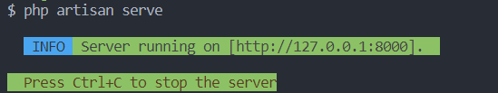
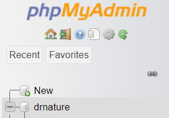
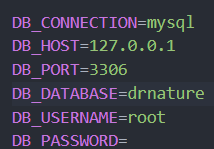
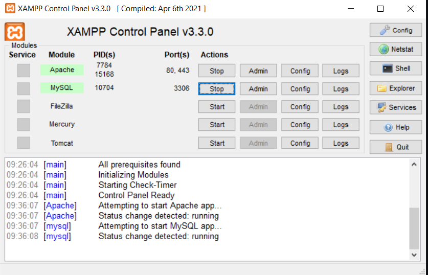

# DrNature-Laravel

### Teste técnico utilizando a última versão do Laravel e um banco de dados, criar uma aplicação web que contenha:
- Uma tela para cadastrar produtos com os campos: código,
nome, descrição e preço;
- Uma tela para listar todos os produtos;
- Uma rota API que recebe o código do produto e retorna
todos os atributos deste produto;
- Use migrations para construir a estrutura de banco de dados que
desejar.


## 	:man_technologist: Tecnologias Utilizadas e links para instalação:
- **PHP** (https://www.php.net/downloads.php) -- Para Windows: (https://windows.php.net/download#php-8.2)
- **Laravel** (https://laravel.com/docs/4.2)
- **XAMPP (MySQL)** (https://www.apachefriends.org/download.html)

&nbsp;


***É necessário que você tenha instalado as três tecnologias para seguir com a aplicação***

&nbsp;

## 🚀 Começando

Essas instruções permitirão que você obtenha uma cópia do projeto em operação na sua máquina local.

Clone este repositório:
```
https://github.com/LucasBinho/DrNature-Laravel.git
```

## Rodando a aplicação:

Para rodas a aplicação basta utilizar o seguinte comando no terminal:
```
php artisan serve
```

Uma mensagem de confirmação deve vir como essa, e um link para clicar e abrir a página no Browser:
  

Com o servidor rodando, é necessário abrir o phpMyAdmin para a criação do banco de dados em sua máquina, através do link:
```
http://localhost/phpmyadmin
```

A criação do banco é simples e rápida: Apenas clicar em New e criar um banco com o nome a sua escolha. 


Utilizei o nome drnature para a criação do meu banco. O nome fica a sua escolha, mas se for modificá-lo, é necessário mudar também o nome de conexão dele ao projeto
através do arquivo .env, como mostrado a seguir:



## :desktop_computer: XAMPP e conexão do banco ao projeto
Para acontecer a conexão do banco de dados ao projeto, é necessário abrir o XAMPP, e com apenas dois cliques, dar o start nos módulos de Apache e MySQL:



Com o banco conectado, o próximo e último passo é apenas migrar as tabelas criadas nos arquivos do projeto e conectar junto ao banco rodando, através
do código no terminal:
```
php artisan migrate
```

Com tudo conectado, agora é só abrir o link do projeto e testar sua funcionalidade, através do link do localhost do terminal utilizado no passo anterior
de Rodando a aplicação:

  


